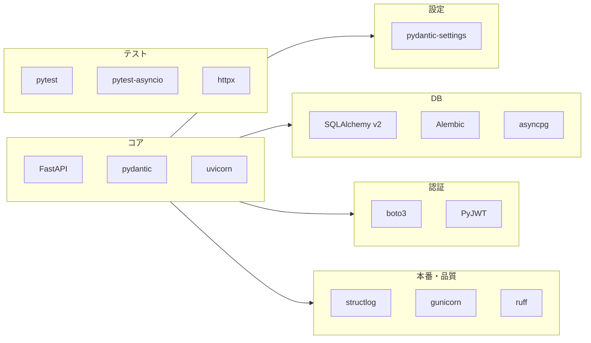

# FastAPI バックエンド技術スタック

## 技術スタック一覧

| カテゴリ | 技術 | 用途 |
|---------|------|------|
| **フレームワーク** | FastAPI | Web API |
| **バリデーション** | pydantic | リクエスト/レスポンス・型検証（FastAPI に同梱） |
| **ASGI サーバー** | uvicorn | 開発用サーバー（`--reload`） |
| **設定** | pydantic-settings | 環境変数・`.env` の型安全な読み込み（`BaseSettings`） |
| **DB ORM** | SQLAlchemy v2 | 非同期対応 ORM・セッション |
| **DB ドライバ** | asyncpg | PostgreSQL 非同期ドライバ（`postgresql+asyncpg://...`） |
| **マイグレーション** | alembic | スキーマ変更管理（非同期時は asyncpg を利用） |
| **認証** | boto3, PyJWT | Cognito 連携・JWT 検証（Cognito 前提） |
| **テスト** | pytest, pytest-asyncio, httpx | 単体・API・非同期テスト（`AsyncClient` + `ASGITransport`） |
| **ロギング** | structlog | 構造化ログ（JSON）・CloudWatch 等連携 |
| **本番サーバー** | gunicorn | マルチワーカー（`-k uvicorn.workers.UvicornWorker`） |
| **開発・品質** | ruff | リント・フォーマット |
| **開発・品質（任意）** | mypy | 型チェック |
| **その他** | python-multipart | フォーム・ファイルアップロード |
| **その他** | email-validator | Pydantic `EmailStr` 用 |
| **その他** | orjson | 高速 JSON シリアライズ（FastAPI が利用） |

## 構成図

## パッケージ一覧（requirements 想定）

| パッケージ | 用途 |
|------------|------|
| fastapi, pydantic, uvicorn | コア |
| pydantic-settings | 設定 |
| sqlalchemy, alembic, asyncpg | DB |
| boto3, PyJWT | 認証（Cognito・JWT） |
| pytest, pytest-asyncio, httpx | テスト |
| structlog, gunicorn | 本番 |
| ruff | 開発（リント・フォーマット） |
| python-multipart, email-validator, orjson | 汎用 |
| mypy | 開発（型チェック・任意） |

## 補足：プロジェクト構成

FastAPI のベストプラクティスとして、**ドメイン/機能ごとにディレクトリを分ける**構成を推奨する。

- `api/app/` 以下に `config.py`, `database.py`, `main.py`（アプリファクトリ）、`auth/`, `users/`, `ingredients/` などのドメインごとのルーター・サービス・モデルを配置する。
- マイグレーションは `api/alembic/` に置き、`sqlalchemy.url` は環境変数（pydantic-settings）から読み込むと運用しやすい。
